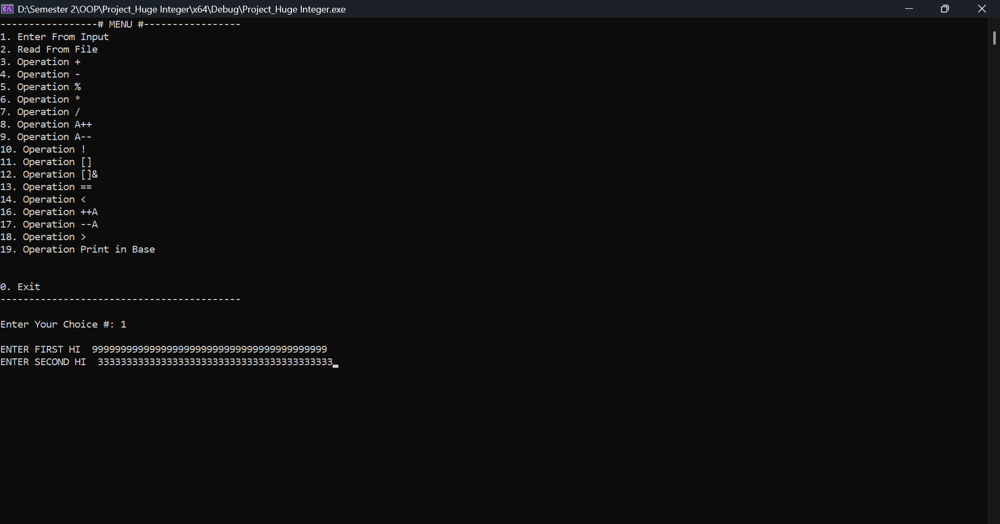
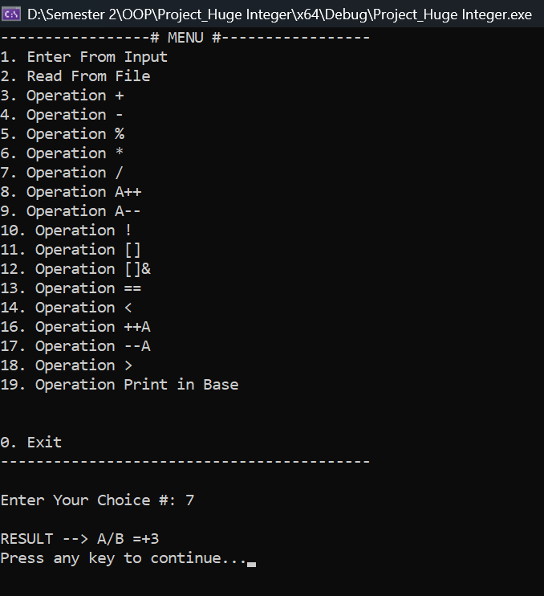
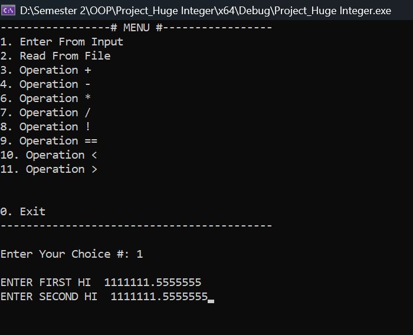
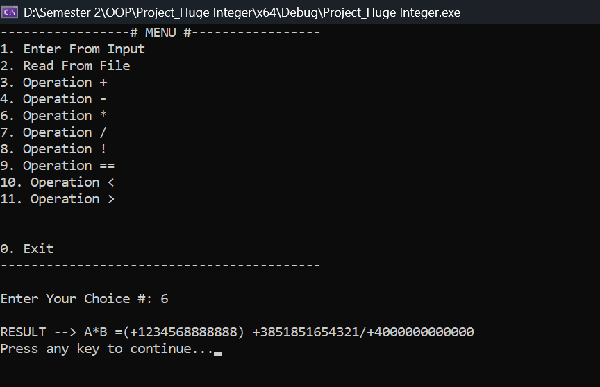

# 🔢 Infinite-Precision Mathematical Engine: HugeInteger & Fractions (C++)

An advanced, arbitrary-precision mathematical computing framework developed in C++. This library bypasses standard hardware limitations (such as the 64-bit caps on primitive types like `long long`) to execute operations on numbers and fractions of infinite length. 

By bridging pure object-oriented architecture with low-level systems logic, this project implements custom algorithms for base conversions, rational fraction simplifications, and high-speed multiplication/division.

---

## 📸 Interactive System Previews


<div align="center">
  
  <p><i>Figure 1: TYPE YOUR DESIRED HUGE INTEGERS.</i></p>
</div>

<br>

<div align="center">
  
  <p><i>Figure 2: DIVISION RESULT !.</i></p>
</div>


<div align="center">
  
  <p><i>Figure 2: TYPE YOUR DESIRED INTEGERS AS YOU WANT.</i></p>
</div>


<div align="center">
  
  <p><i>Figure 2: MULTIPLICATION DEMO (FRACTION).</i></p>
</div>

---

## ⚙️ Feature Matrix & Capabilities

| Module / Layer | Features Supported | Computational Backbone |
| :--- | :--- | :--- |
| **`HI` Arithmetic** | `+`, `-`, `*`, `/`, `%`, prefix/postfix `++`/`--`, unary negation `-` | 10's Complement Logic & Binary Scaling Doubling |
| **`HI` Input/Output** | Direct stream piping (`cin >>`, `cout <<`, `ifstream`, `ofstream`) | Custom overloaded friend stream operators |
| **Radix Translation** | Dynamic base printing from Base 2 up to Base 16 | Remainder distribution processing displaying alphanumeric notations `A` through `F` |
| **`Fraction` Layer** | Auto-Simplification, Improper-to-Mixed mutations, logical conditionals | Combined algebraic fraction cross-multiplication loops |

---

## 🧠 Architectural Deep-Dive & Core Logic

### 1. Straight-Storage Vector Layout
Unlike traditional BigInt engines that reverse string inputs to align indices with place values, this framework stores elements sequentially in their native, left-to-right reading order within a `std::vector<int>`. 
* **The Advantage:** Provides effortless mapping when working with raw character text inputs, linear file-buffer streams (`ifstream`), and straightforward visual debugging arrays without the overhead of constant container re-indexing.

### 2. Hardware-Driven Math: 10's Complement Subtraction
To avoid messy borrow-tracking across large string allocations, this engine borrows a paradigm from Digital Logic Design (DLD) hardware architectures: **r's complement (10's complement)**. Subtraction is natively translated into an inverse addition sequence, stabilizing sign bit checks and optimizing multi-digit vector subtraction operations.

### 3. Logarithmic Scaling: Russian Peasant Doubling
To prevent the immense performance drops of brute-force sequential addition, multiplication and division utilize custom binary scaling mechanics (inspired by the Russian Peasant algorithm). 

```cpp
while (yk > HI("0")) {
    while (C + C <= yk) {
        R += R;  // Scale computation exponentially
        C += C;  // Double the comparative check base
        i++;
    }
    yk -= C;
    gty += R;
    // ... Reset scaling metrics to baseline ...
}

```
**By continually doubling the evaluation matrix scale against operational limits, operations run within a highly optimized timeline of near-logarithmic complexity ≈ O(log N), protecting system memory from execution lag.

### 4. Hybrid Mixed Fraction Ecosystem
The `Fraction` class features a complete rational number structure capable of absolute fractional precision without encountering the rounding limitations of standard floating-point numbers (`double`/`float`). It encapsulates three independent `HI` objects:

* **`HI w`**: Whole Number tracker
* **`HI n`**: Numerator precision digit array
* **`HI d`**: Denominator base engine

The class safely executes rational arithmetic via automated Greatest Common Divisor (GCD) and Least Common Multiple (LCM) calculation matrices powered by the internal Euclidean modulo engine.

---

## 💻 Technical API Showcase
```
// 1. Instantiating Infinite-Length Objects
HI numberA("987654321098765432109876543210");
HI numberB("123456789012345678901234567890");

// 2. Logarithmic Modular Engine Execution
HI quotient  = numberA / numberB;
HI remainder = numberA % numberB;

// 3. System Radix Printing Engine
cout << "Number A translated to Hexadecimal: ";
numberA.printinBase("16"); // Outputs cleanly mapping upper values to custom letters

// 4. Complete Rational Object Processing
Fraction frac1(HI("2"), HI("1"), HI("3"));  // Evaluates to: 2 whole 1/3
Fraction frac2(HI("0"), HI("4"), HI("5"));  // Evaluates to: 4/5
Fraction outcome = frac1 * frac2;           // Computes exact outputs automatically simplified
```

## 🛠️ Toolchain Specs
* **Language Standard:** C++ (Object-Oriented Programming, Operator Overloading, Deep Copy Lifecycle Constructors)
* **Standard Dependencies:** `<vector>`, `<string>`, `<algorithm>`, `<fstream>`
* **Development Platform:** Microsoft Visual Studio

---

## 👨💻 Author
**Ibraheem**
*Batch: AI-25 (Information Technology University)***
